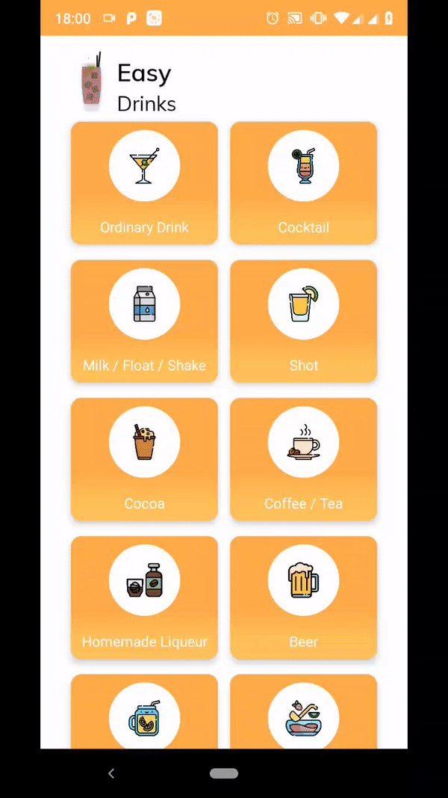

# EasyDrinks_2.0



Application made using the React Native framework, it is a recipe guide for the most diverse types of drinks.

### Run this project on your PC

**ATTENTION**

_Before starting the process you need to have the entire react native development environment configured on your machine_

```sh
git clone https://github.com/igorgabriel12/EasyDrinks_2.0.git
```

```sh
yarn install
```

**To link the fonts on project**

_If you are running Xcode for an iPhone this process can be different. All fonts are in the path ./src/assets/fonts_

```sh
react-native link
```

**ATTENTION**

if you want to run the application on an iphone it will be necessary to run the `sh pod install` command in the ./ios folder before running the following command.

```sh
react-native run-ios or react-native run-android
```
 